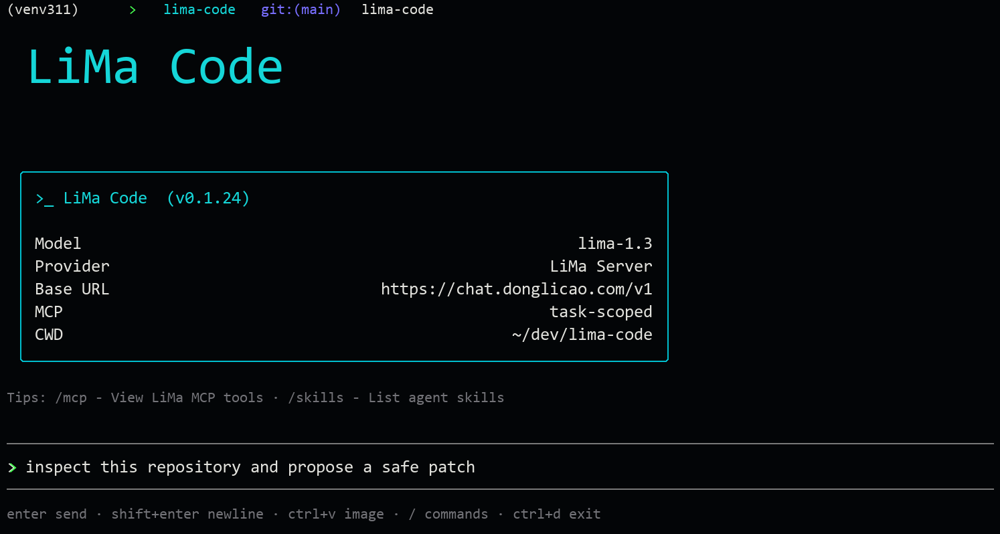

<div align="center">
<br/>
<br/>
<p align="center">
  <a href='https://github.com/zhuguang-ZFG/deepcode-cli'>
    
  </a>
</p>
<h1>LiMa Code CLI</h1>

[![][npm-release-shield]][npm-release-link] [![][npm-downloads-shield]][npm-downloads-link] [![][github-contributors-shield]][github-contributors-link] [![][github-forks-shield]][github-forks-link] [![][github-stars-shield]][github-stars-link]
[![][github-issues-shield]][github-issues-link] [![][github-issues-pr-shield]][github-issues-pr-link] [![][github-license-shield]][github-license-link]

[English](README-en.md) · 中文

<br/>
</div>

[LiMa Code](https://github.com/zhuguang-ZFG/deepcode-cli) 是面向 LiMa 个人编码助手体系改造的终端 AI 编码 worker。它保留 CLI 里的 vibe coding、Agent Skills、MCP、通知和多轮代码工作流，同时可以接入 LiMa Server，由 LiMa 负责模型路由、记忆、健康检查和后端选择。

## 安装

```bash
npm install -g lima-code
```

在任意项目目录下运行 `lima-code` 即可启动。



## 配置

创建 `~/.lima-code/settings.json` 文件，内容如下：

```json
{
  "env": {
    "MODEL": "lima-1.3",
    "BASE_URL": "https://chat.donglicao.com/v1",
    "API_KEY": "<YOUR_LIMA_API_KEY>"
  },
  "thinkingEnabled": false,
  "reasoningEffort": "high"
}
```

也可以把密钥放到环境变量里：

```powershell
$env:LIMA_CODE_MODEL = "lima-1.3"
$env:LIMA_CODE_BASE_URL = "https://chat.donglicao.com/v1"
$env:LIMA_CODE_API_KEY = "<YOUR_LIMA_API_KEY>"
lima-code
```

旧的 `~/.deepcode/settings.json` 仍会作为 fallback 被读取，但新的 LiMa Code 配置应使用 `~/.lima-code/settings.json`。

完整配置说明（多层级优先级、环境变量等）请参阅 [docs/configuration.md](docs/configuration.md)。

## 主要功能

### **Skills**
LiMa Code CLI 支持 agent skills，允许您扩展助手的能力：

- **User-level Skills**：从 `~/.agents/skills/` 目录中发现并激活 skills。
- **Project-level Skills**：从 `./.agents/skills/` 目录中加载项目专属 skills，并兼容旧的 `./.deepcode/skills/` 目录。

### **LiMa Server 接入**
- 默认推荐接入 LiMa 的 OpenAI-compatible endpoint。
- LiMa Code 负责本地 coding worker 体验，LiMa Server 负责模型路由、记忆、健康检查和安全策略。
- 支持 LiMa agent task contract、MCP preset 和任务结果归档的后续扩展。

### **OpenAI-compatible Provider**
- 可直连 LiMa、DeepSeek、火山方舟或其他 OpenAI-compatible API。
- 支持思考模式、推理强度、MCP、联网搜索和任务完成通知。

## 斜杠命令与按键功能

| 斜杠命令        | 操作                               |
|-------------|----------------------------------|
| `/`         | 打开 skills / 命令菜单                 |
| `/new`      | 开始新对话                            |
| `/resume`   | 选择历史对话继续                         |
| `/continue` | 继续当前对话，或选择历史对话恢复                 |
| `/model`    | 切换模型、思考模式和推理强度                   |
| `/raw`      | 切换显示模式（Normal / Lite / Raw 滚动回溯） |
| `/init`     | 初始化 AGENTS.md 文件                 |
| `/skills`   | 列出可用 skills                      |
| `/mcp`      | 查看 MCP 服务器状态和可用工具                |
| `/undo`     | 将代码和/或对话恢复到之前的状态                 |
| `/exit`     | 退出（也可用连续 `Ctrl+D`）               |

| 按键            | 操作                 |
|---------------|--------------------|
| `Enter`       | 发送消息               |
| `Shift+Enter` | 插入换行（也可用 `Ctrl+J`） |
| `Ctrl+V`      | 从剪贴板粘贴图片           |
| `Esc`         | 中断当前模型回复           |
| 连续 `Ctrl+D`   | 退出                 |

## 推荐模型配置

- `lima-1.3`（推荐，通过 LiMa Server 路由）
- DeepSeek V4 系列
- 火山方舟 Coding Plan
- 任何其他 OpenAI-compatible 模型


## 常见问题

### LiMa Code 是否有 VSCode 插件？

当前推荐先使用 CLI。旧 VSCode 插件仍可能能读取兼容配置，但还没有以 LiMa Code 新名称完成重新发布；README 不再把旧插件入口作为推荐安装路径。

### LiMa Code 是否支持理解图片？

LiMa Code 支持从剪贴板粘贴图片，快捷键是 `Ctrl+V`。图片是否真正可被模型理解，取决于你接入的 LiMa 后端或 OpenAI-compatible provider 是否支持多模态。

### 怎样在任务完成后自动给 Slack 发消息？

编写一个调用 Slack webhook 的 Shell 通知脚本，然后在 `~/.lima-code/settings.json` 中将 `notify` 字段设为该脚本的完整路径即可。详细步骤请参考 [docs/notify.md](docs/notify.md)。

### 怎样启用联网搜索功能？

LiMa Code 自带 Web Search 工具。如果你希望使用自定义搜索脚本，可以在 `~/.lima-code/settings.json` 中将 `webSearchTool` 设为脚本的完整路径。

### 如何配置 MCP？

LiMa Code 支持 MCP（Model Context Protocol），可以连接 GitHub、浏览器、数据库等外部服务。在 `settings.json` 中配置 `mcpServers` 字段即可启用，启动后使用 `/mcp` 命令查看已配置的 MCP 服务器状态和可用工具。

详细配置指南：[docs/mcp.md](docs/mcp.md)

### 如何配置 LiMa Code 任务完成后发送通知？

当 AI 助手完成一轮任务后，LiMa Code 可以自动执行一个通知脚本，将任务结果发送到你指定的渠道（如 Slack、系统通知等）。

详细配置指南：[docs/notify.md](docs/notify.md)

### 是否支持 Coding Plan？

支持。只要把 `~/.lima-code/settings.json` 的 `env.BASE_URL` 配置为 OpenAI 兼容的接口地址就行。以火山方舟的 Coding Plan 为例：

```json
{
  "env": {
    "MODEL": "ark-code-latest",
    "BASE_URL": "https://ark.cn-beijing.volces.com/api/coding/v3",
    "API_KEY": "**************"
  },
  "thinkingEnabled": true
}
```

### 是否可以使用 LiMa 作为模型供应方？

可以。LiMa Code 可以指向 LiMa 的 OpenAI-compatible endpoint，由 LiMa 负责模型路由、记忆和后端选择。推荐配置和安全边界见 [docs/lima_zh_CN.md](docs/lima_zh_CN.md)。

## 贡献

欢迎贡献代码！以下是参与方式：

```bash
# 克隆仓库
git clone https://github.com/zhuguang-ZFG/deepcode-cli.git
cd lima-code

# 安装依赖
npm install

# 本地开发（类型检查 + lint + 格式检查 + 构建）
npm run build

# 运行测试
npm test

# 链接到全局（即本地全局安装）
npm link
```

- 提交 PR 前请确保 `npm run check` 通过（类型检查 + lint + 格式检查）
- 建议在执行构建前，先执行 `npm run format` 自动格式化代码，避免构建报错

## 获取帮助

- 在 GitHub Issues 上报告错误或请求功能 (https://github.com/zhuguang-ZFG/deepcode-cli/issues)

## 协议

- MIT

## 支持我们

如果你觉得这个工具对你有帮助，请考虑通过以下方式支持我们：

- 在 GitHub 上给我们一个 Star (https://github.com/zhuguang-ZFG/deepcode-cli)
- 向我们提交反馈和建议
- 分享给你的朋友和同事

<!-- LINK GROUP -->

[npm-release-link]: https://www.npmjs.com/package/lima-code
[npm-release-shield]: https://img.shields.io/npm/v/lima-code?color=4d6BFE&labelColor=black&logo=npm&logoColor=white&style=flat-square&cacheSeconds=1800
[npm-downloads-link]: https://www.npmjs.com/package/lima-code
[npm-downloads-shield]: https://img.shields.io/npm/dt/lima-code?labelColor=black&style=flat-square&color=4d6BFE&cacheSeconds=1800
[github-contributors-link]: https://github.com/zhuguang-ZFG/deepcode-cli/graphs/contributors
[github-contributors-shield]: https://img.shields.io/github/contributors/zhuguang-ZFG/deepcode-cli?color=4d6BFE&labelColor=black&style=flat-square&cacheSeconds=1800
[github-forks-link]: https://github.com/zhuguang-ZFG/deepcode-cli/network/members
[github-forks-shield]: https://img.shields.io/github/forks/zhuguang-ZFG/deepcode-cli?color=4d6BFE&labelColor=black&style=flat-square&cacheSeconds=1800
[github-stars-link]: https://github.com/zhuguang-ZFG/deepcode-cli/network/stargazers
[github-stars-shield]: https://img.shields.io/github/stars/zhuguang-ZFG/deepcode-cli?color=4d6BFE&labelColor=black&style=flat-square&cacheSeconds=1800
[github-issues-link]: https://github.com/zhuguang-ZFG/deepcode-cli/issues
[github-issues-shield]: https://img.shields.io/github/issues/zhuguang-ZFG/deepcode-cli?color=4d6BFE&labelColor=black&style=flat-square&cacheSeconds=1800
[github-issues-pr-link]: https://github.com/zhuguang-ZFG/deepcode-cli/pulls
[github-issues-pr-shield]: https://img.shields.io/github/issues-pr/zhuguang-ZFG/deepcode-cli?color=4d6BFE&labelColor=black&style=flat-square&cacheSeconds=1800
[github-license-link]: https://github.com/zhuguang-ZFG/deepcode-cli/blob/main/LICENSE
[github-license-shield]: https://img.shields.io/github/license/zhuguang-ZFG/deepcode-cli?color=4d6BFE&labelColor=black&style=flat-square&cacheSeconds=1800
